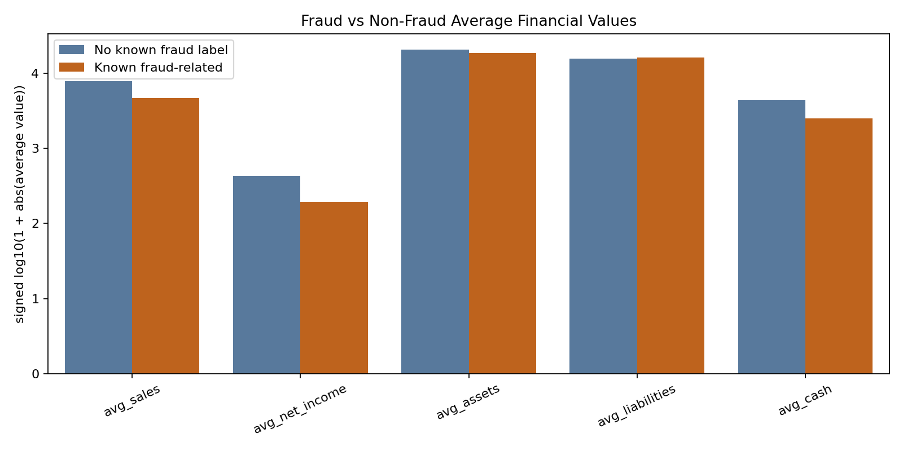

# Focused EDA: Financial Fraud Risk Detection

This report summarizes the focused exploratory analysis for the first-version fraud-risk prioritization project.

Important wording: `target_fraud = 1` means a record is linked to a known fraud-related case through `AAER_ID`. `target_fraud = 0` means no known fraud label is recorded in this dataset; it is not proof that the record was honest.

## 1. Dataset Overview

- Records: `87,974`
- Original columns: `120`
- Generated helper columns for this report: `target_fraud`, `Financial_Year_Number`
- Financial years covered: `1995` to `2018`
- Official modeling feature count for v1: `12`

Each row represents a company-year financial record. The project uses the 12 selected financial features because they are easier to explain in a course presentation and connect directly to financial statements.

Selected features:

`Financial_Year`, `sale`, `ni`, `at`, `lt`, `che`, `rect`, `invt`, `cogs`, `txt`, `xint`, `prcc_f`

## 2. Target Balance

| target_fraud | records | percent |
| --- | --- | --- |
| 0 | 87399 | 99.3464 |
| 1 | 575 | 0.6536 |

Only `575` records are fraud-labeled, compared with `87,399` records with no known fraud label. That is `0.6536%` of the dataset, so this is a highly imbalanced classification problem. This is why later modeling should not rely on accuracy alone.

## 3. Fraud Rate by Year

| Financial_Year | total_records | fraud_cases | fraud_rate_percent |
| --- | --- | --- | --- |
| FY1995 | 2568 | 11 | 0.4283 |
| FY1996 | 2927 | 12 | 0.41 |
| FY1997 | 3329 | 20 | 0.6008 |
| FY1998 | 3618 | 29 | 0.8015 |
| FY1999 | 4134 | 46 | 1.1127 |
| FY2000 | 4048 | 65 | 1.6057 |
| FY2001 | 3892 | 69 | 1.7729 |
| FY2002 | 3878 | 60 | 1.5472 |
| FY2003 | 3977 | 51 | 1.2824 |
| FY2004 | 4078 | 36 | 0.8828 |
| FY2005 | 4072 | 28 | 0.6876 |
| FY2006 | 4081 | 16 | 0.3921 |
| FY2007 | 4039 | 15 | 0.3714 |
| FY2008 | 3727 | 14 | 0.3756 |
| FY2009 | 3671 | 17 | 0.4631 |
| FY2010 | 3649 | 20 | 0.5481 |
| FY2011 | 3603 | 14 | 0.3886 |
| FY2012 | 3578 | 10 | 0.2795 |
| FY2013 | 3600 | 9 | 0.25 |
| FY2014 | 3687 | 11 | 0.2983 |
| FY2015 | 3557 | 8 | 0.2249 |
| FY2016 | 3502 | 8 | 0.2284 |
| FY2017 | 3402 | 5 | 0.147 |
| FY2018 | 3357 | 1 | 0.0298 |

The highest fraud-label rate appears in `FY2001` at `1.7729%`. The year-level pattern helps show that fraud-labeled records are not evenly distributed over time.

## 4. Distribution of Key Financial Variables

The variables `sale`, `ni`, `at`, `lt`, and `che` have very wide ranges and visible outliers. The chart uses a signed log transform, `sign(value) * log10(1 + abs(value))`, so very large positive and negative values can fit into a readable presentation chart without deleting records.

In simple terms, this section shows that financial statement data is not evenly shaped. A few very large companies or unusual records can dominate raw-scale charts, so presentation-safe scaling is necessary.

## 5. Fraud vs Non-Fraud Comparison

| target_fraud | records | avg_sales | avg_net_income | avg_assets | avg_liabilities | avg_cash |
| --- | --- | --- | --- | --- | --- | --- |
| 0 | 87399 | 7739 | 428.34 | 20335.17 | 15512.79 | 4433.98 |
| 1 | 575 | 4679.09 | 192.53 | 18328.12 | 16010.56 | 2499.1 |

Additional ratio comparison:

| target_fraud | records | avg_receivables_to_sales_ratio | avg_liabilities_to_assets_ratio |
| --- | --- | --- | --- |
| 0 | 87399 | 0.2931 | 0.5968 |
| 1 | 575 | 0.9426 | 0.5298 |

The most useful presentation finding is the receivables-to-sales ratio: fraud-labeled records average `0.9426`, while records with no known fraud label average `0.2931`. This does not prove fraud, but it supports the business idea that unusually high receivables relative to sales can be a warning signal around revenue quality.

## 6. Feature Relationship Check

The heatmap checks relationships among the 12 selected features. Correlation can reveal redundancy or strong relationships between inputs, but it is not causation and it is not proof of fraud.

Correlation matrix:

| feature | Financial_Year | sale | ni | at | lt | che | rect | invt | cogs | txt | xint | prcc_f |
| --- | --- | --- | --- | --- | --- | --- | --- | --- | --- | --- | --- | --- |
| Financial_Year | 1 | 0.012 | 0.02 | 0.015 | 0.015 | 0.013 | 0.004 | -0.005 | 0.012 | 0.011 | -0.007 | 0.002 |
| sale | 0.012 | 1 | 0.813 | 0.948 | 0.941 | 0.897 | 0.687 | 0.462 | 0.993 | 0.796 | -0.878 | 0 |
| ni | 0.02 | 0.813 | 1 | 0.875 | 0.85 | 0.774 | 0.613 | 0.167 | 0.794 | 0.807 | -0.69 | 0 |
| at | 0.015 | 0.948 | 0.875 | 1 | 0.996 | 0.946 | 0.669 | 0.275 | 0.938 | 0.768 | -0.867 | 0 |
| lt | 0.015 | 0.941 | 0.85 | 0.996 | 1 | 0.961 | 0.635 | 0.245 | 0.936 | 0.731 | -0.871 | 0 |
| che | 0.013 | 0.897 | 0.774 | 0.946 | 0.961 | 1 | 0.57 | 0.151 | 0.905 | 0.632 | -0.848 | 0 |
| rect | 0.004 | 0.687 | 0.613 | 0.669 | 0.635 | 0.57 | 1 | 0.55 | 0.635 | 0.689 | -0.632 | 0 |
| invt | -0.005 | 0.462 | 0.167 | 0.275 | 0.245 | 0.151 | 0.55 | 1 | 0.418 | 0.479 | -0.411 | 0 |
| cogs | 0.012 | 0.993 | 0.794 | 0.938 | 0.936 | 0.905 | 0.635 | 0.418 | 1 | 0.753 | -0.864 | 0 |
| txt | 0.011 | 0.796 | 0.807 | 0.768 | 0.731 | 0.632 | 0.689 | 0.479 | 0.753 | 1 | -0.625 | 0 |
| xint | -0.007 | -0.878 | -0.69 | -0.867 | -0.871 | -0.848 | -0.632 | -0.411 | -0.864 | -0.625 | 1 | 0 |
| prcc_f | 0.002 | 0 | 0 | 0 | 0 | 0 | 0 | 0 | 0 | 0 | 0 | 1 |

## Phase 2 Takeaway

The data is large enough for modeling, but the positive fraud label is extremely rare. The EDA supports the project direction: this should be framed as ranking records for review, not proving fraud. The receivables-to-sales difference gives a simple financial signal that can be explained clearly in the final presentation.
