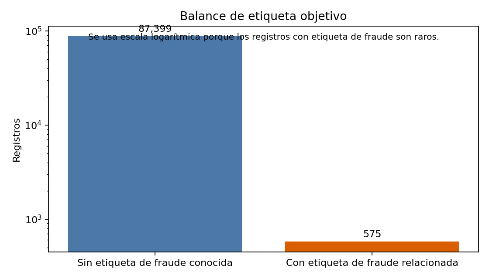
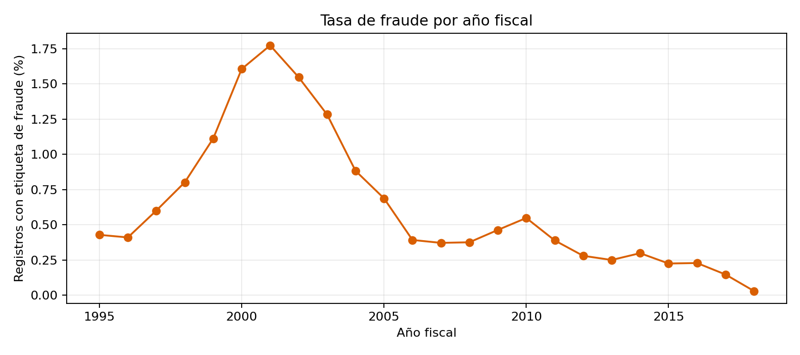
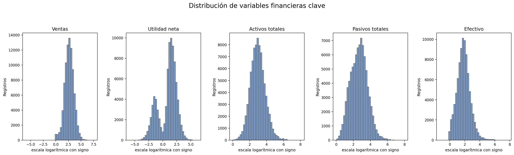
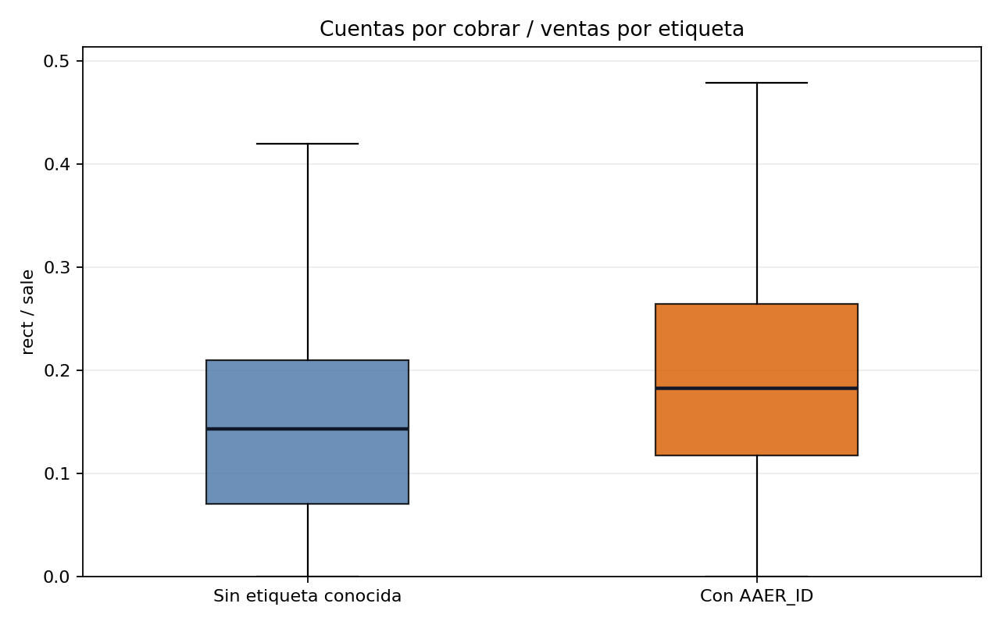
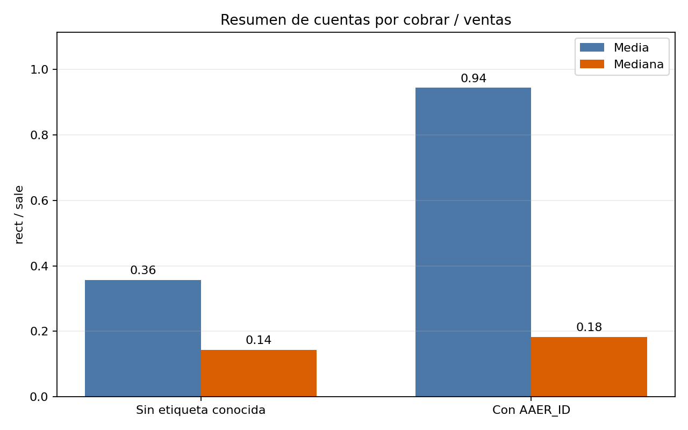
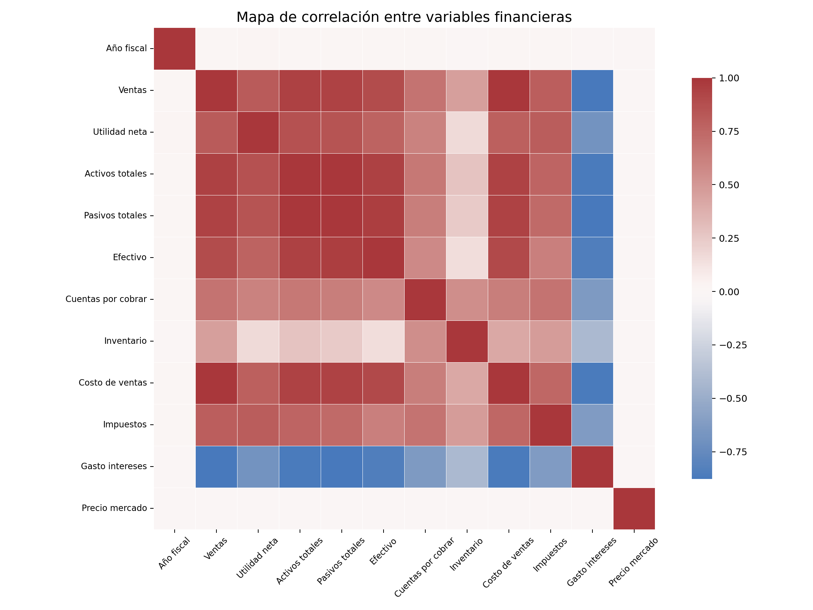

# EDA enfocado: detección de riesgo de fraude financiero

Este reporte resume el análisis exploratorio enfocado para el proyecto de priorización de riesgo de fraude (versión 1).

Mensaje clave: `target_fraud = 1` indica un caso vinculado a fraude conocido por `AAER_ID`.
`target_fraud = 0` significa que este dataset no trae etiqueta de fraude conocida; no demuestra que el registro sea limpio.

## 1. Resumen del dataset

- Registros: `87,974`
- Columnas originales: `120`
- Columnas auxiliares generadas para este reporte: `target_fraud`, `Financial_Year_Number`
- Años fiscales cubiertos: `1995` a `2018`
- Variables oficiales de modelado (v1): `12`

Cada fila representa un registro empresa-año de estados financieros. Se usan 12 variables para que sea fácil de explicar en presentación de curso.

Variables usadas:

`Financial_Year`, `sale`, `ni`, `at`, `lt`, `che`, `rect`, `invt`, `cogs`, `txt`, `xint`, `prcc_f`

## 2. Balance de etiqueta objetivo

| etiqueta_fraude | registros | porcentaje |
| --- | --- | --- |
| 0 | 87399 | 99.3464 |
| 1 | 575 | 0.6536 |

Solo hay `575` registros con etiqueta de fraude y `87,399` sin etiqueta conocida.
Eso representa `0.6536%` del dataset. El problema está fuertemente desbalanceado y por eso no se debe usar accuracy como métrica principal.

## 3. Tasa de fraude por año

| ejercicio_fiscal | total_registros | casos_fraude | tasa_fraude_porcentaje |
| --- | --- | --- | --- |
| FY1995 | 2568 | 11 | 0.4283 |
| FY1996 | 2927 | 12 | 0.41 |
| FY1997 | 3329 | 20 | 0.6008 |
| FY1998 | 3618 | 29 | 0.8015 |
| FY1999 | 4134 | 46 | 1.1127 |
| FY2000 | 4048 | 65 | 1.6057 |
| FY2001 | 3892 | 69 | 1.7729 |
| FY2002 | 3878 | 60 | 1.5472 |
| FY2003 | 3977 | 51 | 1.2824 |
| FY2004 | 4078 | 36 | 0.8828 |
| FY2005 | 4072 | 28 | 0.6876 |
| FY2006 | 4081 | 16 | 0.3921 |
| FY2007 | 4039 | 15 | 0.3714 |
| FY2008 | 3727 | 14 | 0.3756 |
| FY2009 | 3671 | 17 | 0.4631 |
| FY2010 | 3649 | 20 | 0.5481 |
| FY2011 | 3603 | 14 | 0.3886 |
| FY2012 | 3578 | 10 | 0.2795 |
| FY2013 | 3600 | 9 | 0.25 |
| FY2014 | 3687 | 11 | 0.2983 |
| FY2015 | 3557 | 8 | 0.2249 |
| FY2016 | 3502 | 8 | 0.2284 |
| FY2017 | 3402 | 5 | 0.147 |
| FY2018 | 3357 | 1 | 0.0298 |

La mayor tasa de etiqueta de fraude aparece en `FY2001` con `1.7729%`.
Esto muestra que los casos conocidos de fraude no están distribuidos de forma uniforme en el tiempo.
El pico alrededor de 2000-2002 también coincide con un período de fuerte escrutinio contable en Estados Unidos: caída de la burbuja puntocom, casos como Enron, WorldCom y Tyco, y aprobación de Sarbanes-Oxley en 2002.
Por eso conviene interpretarlo como concentración de registros con AAER_ID conocidos en ese contexto, no como una medición de todo el fraude real de la economía.

## 4. Distribución de variables financieras clave

Las variables `sale`, `ni`, `at`, `lt` y `che` tienen rangos amplios y outliers visibles.
Se aplica transformación `signo(log10(1 + abs(valor)))` para graficarlas sin eliminar registros extremos.

En términos simples, algunos registros muy grandes pueden dominar una escala lineal, por eso se usa escalado seguro para presentación.

## 5. Cuentas por cobrar sobre ventas

Resumen del ratio `rect / sale`:

| etiqueta_fraude | registros_validos | media_rect_sale | mediana_rect_sale | percentil_75_rect_sale |
| --- | --- | --- | --- | --- |
| 0 | 86930 | 0.3569 | 0.1433 | 0.2102 |
| 1 | 574 | 0.9443 | 0.1825 | 0.2648 |

Hallazgo útil: la media de `rect / sale` es `0.9443` en casos etiquetados y `0.3569` en no etiquetados.
La mediana también es mayor en casos etiquetados: `0.1825` frente a `0.1433`.
No prueba fraude, pero sí da una señal de alerta operativa: ventas registradas que todavía no se transformaron en cobros pueden merecer revisión.

## 6. Revisión de relación entre variables

El mapa de calor muestra relaciones entre las 12 variables usadas. Puede indicar redundancia o relaciones fuertes, pero no significa causalidad ni prueba de fraude.

Matriz de correlación:

| variable | Año fiscal | Ventas | Utilidad neta | Activos totales | Pasivos totales | Efectivo | Cuentas por cobrar | Inventario | Costo de ventas | Impuestos | Gasto intereses | Precio mercado |
| --- | --- | --- | --- | --- | --- | --- | --- | --- | --- | --- | --- | --- |
| Año fiscal | 1 | 0.012 | 0.02 | 0.015 | 0.015 | 0.013 | 0.004 | -0.005 | 0.012 | 0.011 | -0.007 | 0.002 |
| Ventas | 0.012 | 1 | 0.813 | 0.948 | 0.941 | 0.897 | 0.687 | 0.462 | 0.993 | 0.796 | -0.878 | 0 |
| Utilidad neta | 0.02 | 0.813 | 1 | 0.875 | 0.85 | 0.774 | 0.613 | 0.167 | 0.794 | 0.807 | -0.69 | 0 |
| Activos totales | 0.015 | 0.948 | 0.875 | 1 | 0.996 | 0.946 | 0.669 | 0.275 | 0.938 | 0.768 | -0.867 | 0 |
| Pasivos totales | 0.015 | 0.941 | 0.85 | 0.996 | 1 | 0.961 | 0.635 | 0.245 | 0.936 | 0.731 | -0.871 | 0 |
| Efectivo | 0.013 | 0.897 | 0.774 | 0.946 | 0.961 | 1 | 0.57 | 0.151 | 0.905 | 0.632 | -0.848 | 0 |
| Cuentas por cobrar | 0.004 | 0.687 | 0.613 | 0.669 | 0.635 | 0.57 | 1 | 0.55 | 0.635 | 0.689 | -0.632 | 0 |
| Inventario | -0.005 | 0.462 | 0.167 | 0.275 | 0.245 | 0.151 | 0.55 | 1 | 0.418 | 0.479 | -0.411 | 0 |
| Costo de ventas | 0.012 | 0.993 | 0.794 | 0.938 | 0.936 | 0.905 | 0.635 | 0.418 | 1 | 0.753 | -0.864 | 0 |
| Impuestos | 0.011 | 0.796 | 0.807 | 0.768 | 0.731 | 0.632 | 0.689 | 0.479 | 0.753 | 1 | -0.625 | 0 |
| Gasto intereses | -0.007 | -0.878 | -0.69 | -0.867 | -0.871 | -0.848 | -0.632 | -0.411 | -0.864 | -0.625 | 1 | 0 |
| Precio mercado | 0.002 | 0 | 0 | 0 | 0 | 0 | 0 | 0 | 0 | 0 | 0 | 1 |

## Conclusión de la fase

El dataset alcanza tamaño suficiente para modelar, pero la etiqueta positiva es muy rara.
La EDA respalda enmarcar el proyecto como priorización de revisión, no como prueba de fraude.
La diferencia en cuentas por cobrar/ventas aporta una señal financiera clara para la presentación final.
